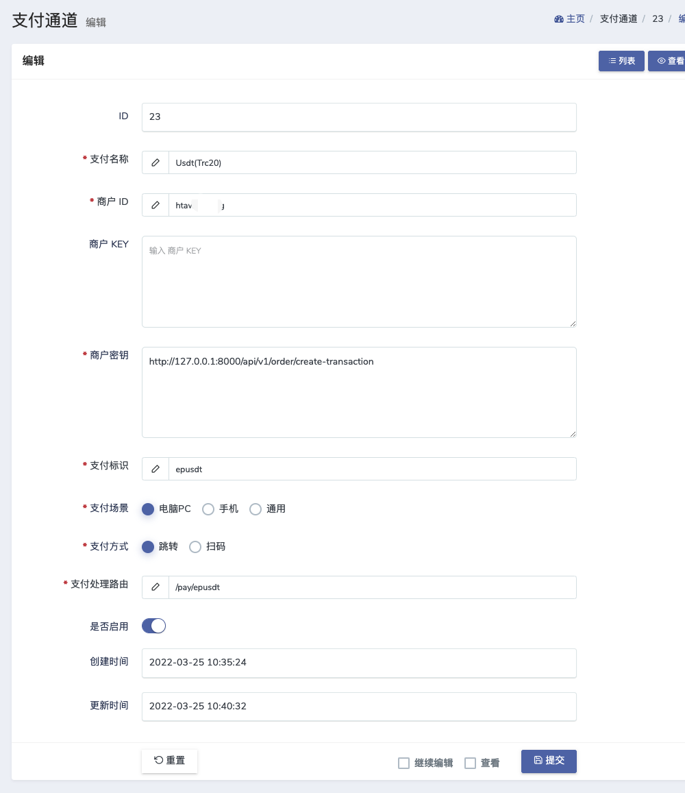

## 使用方法
### 注意此插件仅适用于独角数卡2.0.4版本以下，2.0.4版本或以上的独角数卡已经内置此插件，无需配置

1.将`app`和`routes`目录覆盖到网站根目录。      
2.在独角数卡后台添加一个支付方式。      

| 支付选项 | 商户id | 商户key | 商户密钥 | 备注 |
| :-----| :----- | :----- | :----- |:-----|
| Epusdt | Epusdt 后台 API 密钥中的 PID | Epusdt 后台 API 密钥中的 Secret | `https://支付域名/payments/gmpay/v1/order/create-transaction` | 同机部署可填写容器或内网地址 |

> v1.0.10 不再使用旧的 `api_auth_token`。请在 Epusdt 管理后台的“API 密钥”页面创建或查看 PID 与 Secret。

示例：     

